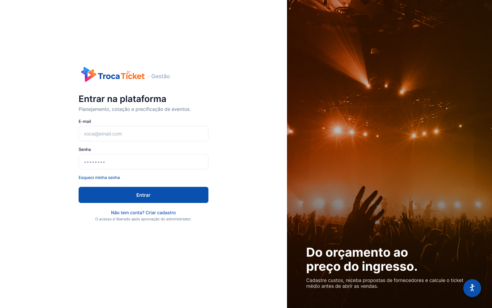

# FECAP - Fundação de Comércio Álvares Penteado

<p align="center">
<a href= "https://www.fecap.br/"></a>
</p>

# Gestão Troca Ticket

## DKCA DEVS

## Integrantes: <a href="https://www.linkedin.com/in/andre-makoto-molitor/">Andre Makoto Molitor</a>, <a href="https://www.linkedin.com/in/caio-fabio-freitas/">Caio Fabio Freitas</a>, <a href="https://www.linkedin.com/in/davivarella/">Davi Varella</a>, <a href="https://www.linkedin.com/in/kaua-casella/">Kauã Casella da Silva</a>

## Professores Orientadores: <a href="https://www.linkedin.com/in/cristina-machado-corr%C3%AAa-leite-630309160/">Cristina Machado Corrêa Leite</a>, <a href="https://www.linkedin.com/in/dolemes/">David de Oliveira Lemes</a>, <a href="https://www.linkedin.com/in/francisco-escobar/">Francisco de Souza Escobar</a>, <a href="https://www.linkedin.com/in/j%C3%A9sus-gomes-83b769108/">Jésus Gomes</a>, <a href="https://www.linkedin.com/in/katia-bossi/">Kátia Bossi</a>

## Descrição

<p align="center">

<br>
Tela de login da plataforma, do protótipo navegável.
</p>

A **Gestão Troca Ticket** é uma plataforma Web de planejamento e precificação de eventos, desenvolvida como Projeto Interdisciplinar do 2º semestre de Ciência da Computação da FECAP. A TrocaTicket, empresa parceira, nasceu para facilitar a troca e a revenda de ingressos de festas universitárias e hoje quer apoiar organizadores já na etapa de planejamento: estruturar os custos do evento, receber propostas de fornecedores e estimar o valor do ingresso antes da realização.

A aplicação é organizada em três módulos integrados. O **Organizador** cadastra eventos, itens de composição de custo e parâmetros financeiros; o **Fornecedor** visualiza as oportunidades publicadas e envia propostas vinculadas aos itens; o **Administrador (TrocaTicket)** aprova os cadastros, acompanha os eventos e consulta relatórios gerenciais. A partir dos custos consolidados, do público previsto e da margem de lucro definida, o sistema calcula o ticket estimado do evento.

Para efeito do projeto, cada evento possui apenas um tipo de ingresso e o MVP não realiza venda nem processamento de pagamentos: o foco é o planejamento, a cotação e o cálculo do ticket.

## 🎯 Funcionalidades

| ID   | Funcionalidade                     | Descrição                                                                             |
| ---- | ---------------------------------- | ------------------------------------------------------------------------------------- |
| RF01 | Autocadastro de Organizador        | Criação de conta que permanece pendente até análise do Administrador.                  |
| RF02 | Autocadastro de Fornecedor         | Criação de conta com dados de identificação e atuação, pendente até aprovação.         |
| RF03 | Aprovação de cadastros             | Administrador aprova ou rejeita cadastros, registrando o status do usuário.            |
| RF04 | Autenticação e perfis              | Acesso restrito conforme o perfil: Administrador, Organizador ou Fornecedor.           |
| RF05 | Cadastro de eventos                | Período, local, público mínimo, público máximo, status e demais dados do evento.       |
| RF06 | Itens de composição de custo       | Iluminação, comida, bebida, segurança, estrutura e outros serviços ou produtos.        |
| RF07 | Custos do evento                   | Custos fiscais, operacionais, variáveis e outros não provenientes de propostas.        |
| RF08 | Publicação para cotação            | Disponibiliza eventos e itens para os Fornecedores aprovados.                          |
| RF09 | Consulta de eventos pelo Fornecedor| Listagem dos eventos disponíveis para envio de propostas.                              |
| RF10 | Envio de propostas                 | Proposta vinculada ao evento/item, com valor, descrição, validade e observações.       |
| RF11 | Consulta e comparação de propostas | Organizador compara valores e informações das propostas recebidas por item.            |
| RF12 | Seleção e consolidação de orçamento| Seleção das propostas que compõem o orçamento e consolidação dos custos.               |
| RF13 | Cálculo do ticket                  | Ticket estimado a partir dos custos, do público e da margem, com cenários mín. e máx.  |
| RF14 | Visão administrativa e relatórios  | Consultas e relatórios gerenciais sobre usuários, eventos, propostas e valores.        |

O cálculo adotado, quando a margem é definida sobre a receita, é `Ticket = Custo Total / [Público × (1 − Margem)]`, com validações que impedem valores inválidos.

## 🛠 Estrutura de pastas

-Raiz<br>
|<br>
|-->Documentos<br>
&emsp;|-->Entrega 1<br>
&emsp;&emsp;|-->Calculo II<br>
&emsp;&emsp;|-->Desenvolvimento Web Fullstack<br>
&emsp;&emsp;|-->Gestao Empresarial e Dinamica das Organizacoes<br>
&emsp;&emsp;|-->Projeto em Banco de Dados<br>
&emsp;&emsp;|-->Projeto Interdisciplinar - Programacao Web<br>
&emsp;|-->Entrega 2<br>
&emsp;&emsp;|-->(mesmas pastas da Entrega 1)<br>
|-->Imagens<br>
|-->src<br>
&emsp;|-->Backend<br>
&emsp;|-->Frontend<br>
|README.md<br>

<b>Documentos</b>: documentação do projeto separada por entrega e por Unidade Curricular. Reúne os diagramas do banco de dados, os documentos de Gestão Empresarial, as entregas de Cálculo II e o protótipo navegável.

<b>Imagens</b>: capturas de tela do sistema e imagens usadas na documentação.

<b>src</b>: código-fonte da aplicação, dividido entre <b>Backend</b> (API Node.js + Express com MySQL) e <b>Frontend</b> (aplicação React criada com Vite).

<b>README.md</b>: este arquivo, que serve como guia geral do projeto.

## 🗄 Banco de dados

A modelagem do banco está em [Documentos/Entrega 1/Projeto em Banco de Dados](Documentos/Entrega%201/Projeto%20em%20Banco%20de%20Dados), com o diagrama entidade-relacionamento e o modelo lógico relacional do sistema. Os scripts SQL e a descrição das tabelas acompanham a implementação inicial do banco.

## 🎨 Protótipo

O protótipo navegável das telas foi construído no Figma e cobre os principais fluxos dos módulos Administrador, Organizador e Fornecedor: <https://www.figma.com/design/0oyfFP6b20mcmb75p0lVVF/TrocaTicket---Telas>

## 🛠 Instalação

A aplicação é uma plataforma Web: não há executável para instalar. Basta acessar o endereço publicado pelo navegador, em desktop ou dispositivo móvel.

Para rodar localmente, siga a seção de configuração abaixo.

## 💻 Configuração para Desenvolvimento

Ferramentas necessárias:

- <a href="https://nodejs.org">Node.js</a> 22 ou superior
- <a href="https://git-scm.com">Git</a>
- <a href="https://dev.mysql.com/downloads/">MySQL</a> (para o backend)
- Um editor de código, como o <a href="https://code.visualstudio.com/">VS Code</a>

Clonar o repositório e rodar o front-end:

```sh
git clone https://github.com/2026-2-MCC2/Projeto2.git
cd Projeto2/src/Frontend
cp .env.example .env
npm install
npm run dev
```

O endereço local aparece no terminal, normalmente <http://localhost:5173>.

O passo a passo detalhado da instalação, com os erros mais comuns, está em [src/Frontend/COMO_RODAR.md](src/Frontend/COMO_RODAR.md). A organização em camadas do front-end é explicada em [src/Frontend/README.md](src/Frontend/README.md).

Comandos disponíveis no front-end:

```sh
npm run dev      # servidor de desenvolvimento
npm run build    # gera a versão de produção
npm run lint     # procura erros no código
npm run format   # formata o código
```

## 🧰 Tecnologias

- **Front-end**: React, React Router e Vite
- **Back-end**: Node.js com Express
- **Banco de dados**: MySQL
- **Testes de API**: Postman
- **Prototipação**: Figma
- **Modelagem de dados**: brModelo e MySQL Workbench
- **Versionamento e gestão**: Git, GitHub e GitHub Project

## 📋 Licença/License

<p xmlns:cc="http://creativecommons.org/ns#" xmlns:dct="http://purl.org/dc/terms/"><a property="dct:title" rel="cc:attributionURL" href="https://github.com/2026-2-MCC2/Projeto2">Gestão Troca Ticket</a> by <span property="cc:attributionName">DKCA DEVS</span> is licensed under <a href="https://creativecommons.org/licenses/by/4.0/" target="_blank" rel="license noopener noreferrer">CC BY 4.0</a></p>

## 🎓 Referências

1. <https://github.com/iuricode/readme-template>
2. <https://github.com/gabrieldejesus/readme-model>
3. <https://chooser-beta.creativecommons.org/>
4. <https://www.toptal.com/developers/gitignore>
5. <https://react.dev/>
6. <https://vite.dev/>
7. <https://expressjs.com/pt-br/>
8. <https://dev.mysql.com/doc/>
